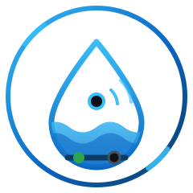
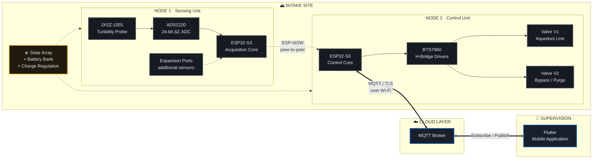
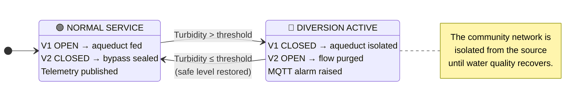
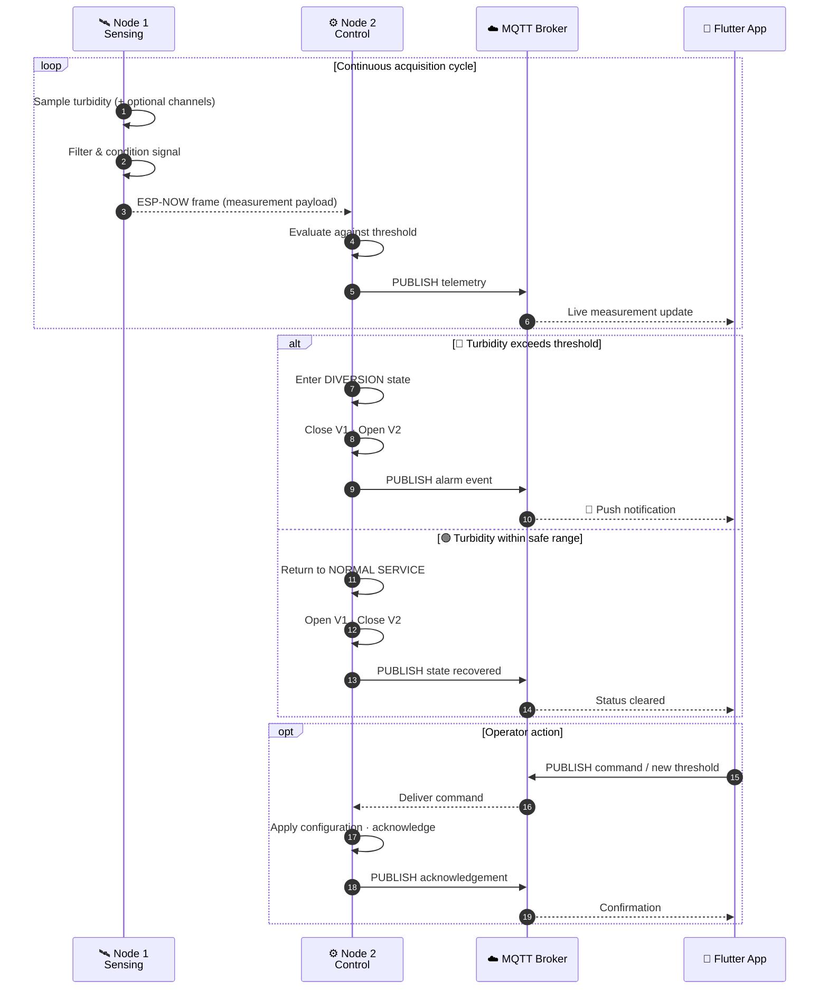
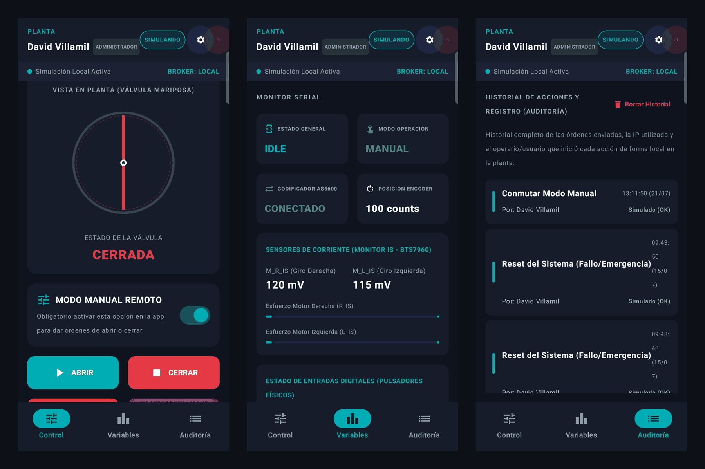

<!--
  CONCAP — Control de Captación
  Intelligent Water Intake Monitoring and Automation System
  © 2026 — All Rights Reserved. Proprietary technical showcase.
-->

<div align="center">



# CONCAP

### **Control de Captación**

**Intelligent Water Intake Monitoring and Automation System**

*Real-time turbidity monitoring, autonomous valve control, and remote supervision for rural community aqueducts.*

<br/>


<br/>
<br/>

[](#-results)
[](CHANGELOG.md)
[](LICENSE)

[](#-hardware-overview)
[](#-communication-flow)
[](#-software-overview)
[](#-mobile-application)
[](#-hardware-overview)
[](#-hardware-overview)
[](docs/)

<br/>

**[Overview](#-overview)** · **[Features](#-features)** · **[Architecture](#-architecture)** · **[Hardware](#-hardware-overview)** · **[Software](#-software-overview)** · **[App](#-mobile-application)** · **[Gallery](#-gallery)** · **[Results](#-results)** · **[Contact](#-contact)**

</div>

<br/>

> [!IMPORTANT]
> **Proprietary Technical Showcase.** The source code, firmware, PCB design files, schematics, calibration models, and control algorithms are proprietary and are **not included** in this repository. This repository documents system architecture, engineering decisions, and field results only. See [Intellectual Property Notice](#-intellectual-property-notice).

<br/>

---

## 📖 Overview

Rural community aqueducts across mountainous regions share a recurring failure mode: after heavy rainfall, source water turbidity spikes within minutes. Without supervision, sediment-laden water enters the distribution network, contaminating storage tanks and forcing multi-day service interruptions while the system is flushed and disinfected.

**CONCAP** (*Control de Captación* — "Intake Control") is a solar-powered industrial IoT system that closes this loop automatically. It continuously measures raw water quality at the intake, and when turbidity crosses a configurable threshold, it autonomously diverts flow away from the aqueduct and raises a remote alarm — before contaminated water ever reaches the community.

The system was designed, built, and **deployed in the field** for an operating rural aqueduct.

<table>
<tr>
<td width="33%" valign="top">

### 🎯 Problem

Turbidity events go undetected until water is already contaminated. Manual valve operation requires an operator physically present at a remote intake, often at night and during storms.

</td>
<td width="33%" valign="top">

### 💡 Solution

A two-node distributed controller that measures, decides, and actuates autonomously at the intake — with full remote visibility from a mobile application.

</td>
<td width="33%" valign="top">

### ✅ Outcome

Contamination events are contained in seconds instead of hours. Operators receive push alarms and can supervise the intake without traveling to the site.

</td>
</tr>
</table>

<br/>

---

## ✨ Features

| | Capability | Description |
|:---:|:---|:---|
| 🌊 | **Real-Time Turbidity Monitoring** | Continuous optical turbidity acquisition through a 24-bit precision analog front-end. |
| 🧩 | **Expandable Sensing Architecture** | The analog front-end and acquisition layer accept additional water-quality and environmental sensors without redesigning the node. |
| ⚙️ | **Autonomous Valve Actuation** | Dual motorized valves driven under closed-loop logic with position feedback and end-stop protection. |
| 📡 | **Resilient Local Link** | ESP-NOW connectionless radio between field nodes — no local Wi-Fi infrastructure required at the intake. |
| ☁️ | **Cloud Telemetry & Alarms** | MQTT publish/subscribe pipeline for live measurements, state changes, and alarm events. |
| 📱 | **Mobile Supervision** | Cross-platform Flutter application for live monitoring, threshold configuration, and manual override. |
| 🔋 | **Energy Autonomy** | Solar array with battery bank and charge regulation; designed for unattended operation off-grid. |
| 🛡️ | **Industrial Ruggedization** | IP66 outdoor enclosure, cable glanding, and surge/transient protection on all field wiring. |
| 🔁 | **Fail-Safe Behavior** | Defined safe states on power loss, link loss, and sensor fault — the aqueduct is never left exposed. |

<br/>

---

## 🏗 Architecture

CONCAP is a **two-node distributed architecture**. Sensing is decoupled from actuation, which keeps the high-current motor stage electrically and physically isolated from the sensitive analog measurement chain.



<div align="center">
<sub>📐 Detailed layer-by-layer architecture: <a href="docs/Architecture.md"><b>docs/Architecture.md</b></a></sub>
</div>

<br/>

### Control Strategy

The controller implements a **hysteretic diversion policy** over the turbidity signal. Node 2 evaluates every incoming measurement against an operator-configurable threshold and drives the valve pair into one of two mutually exclusive hydraulic states.



> The threshold, dwell time, and hysteresis band are **field-configurable from the mobile application** without reflashing firmware.

<br/>

---

## 🔧 Hardware Overview

<div align="center">

</div>

<br/>

### Bill of Subsystems

| Subsystem | Component | Role |
|:---|:---|:---|
| **Compute** | ESP32-S3 (×2) | Dual-core MCU with integrated Wi-Fi and 2.4 GHz radio; one per node. |
| **Water Quality** | JXSZ-1001 | Optical turbidity probe, submersible, intake-mounted. |
| **Analog Front-End** | ADS1220 | 24-bit ΔΣ ADC with PGA and low-noise reference for stable turbidity resolution. |
| **Actuation** | Dual DC gear motors | High-torque geared drives coupled to the intake valves. |
| **Motor Drive** | BTS7960 (×2) | High-current H-bridge stage with direction and PWM control. |
| **Energy** | Solar panel + battery bank | Off-grid autonomous supply with charge regulation and low-voltage protection. |
| **Enclosure** | IP66 rated | Sealed outdoor housing with cable glands, DIN mounting, and thermal management. |

<br/>

### Sensor Expansion

The sensing node was deliberately designed around a **generic acquisition layer** rather than a fixed sensor set. Turbidity is the parameter that drives the control decision, but the analog front-end, power budget, and telemetry payload were sized to accommodate further instrumentation. Any parameter available as a standard commercial module can be integrated without altering the node architecture or the control logic.

| Parameter | Typical commercial module | Interface | Value added |
|:---|:---|:---:|:---|
| **Ambient temperature & humidity** | DHT22 · SHT31 · BME280 | Digital / I²C | Enclosure health, condensation risk, seasonal correlation. |
| **Water temperature** | DS18B20 (waterproof probe) | 1-Wire | Temperature compensation of water-quality readings. |
| **pH** | Analog pH probe + signal board | Analog | Regulatory potability compliance. |
| **Electrical conductivity / TDS** | TDS or EC analog probe | Analog | Dissolved solids and mineral load tracking. |
| **Flow rate** | YF-S201 · hall-effect flowmeter | Pulse | Volumetric accounting and leak detection. |
| **Water level** | Ultrasonic or submersible pressure | Digital / Analog | Intake and reservoir level supervision. |
| **Rainfall** | Tipping-bucket pluviometer | Pulse | Precursor signal for anticipating turbidity events. |
| **Barometric pressure** | BMP280 | I²C | Weather context for predictive strategies. |

> [!NOTE]
> The table above documents **integration capability**, not the current deployed configuration. The system as installed operates on turbidity as its control variable; additional channels are enabled per project scope.

<br/>

<div align="center">

<br/><sub><b>Sensing subsystem</b> — turbidity probe and analog front-end</sub>
</div>

> [!NOTE]
> Electrical schematics, PCB layouts, mechanical drawings, and enclosure CAD are **proprietary and withheld**. The table above documents the architecture at subsystem level only.

<br/>

---

## 💻 Software Overview

### Firmware Layers

| Layer | Responsibility |
|:---|:---|
| **Acquisition Layer** *(Node 1)* | Sensor sampling, digital filtering, unit conversion, and payload framing. Channel-agnostic — new sensors are registered without touching downstream layers. |
| **Transport Layer** | ESP-NOW peer management, retry handling, and link-loss detection between nodes. |
| **Control Layer** *(Node 2)* | Threshold evaluation, hysteresis, valve state machine, and fail-safe arbitration. |
| **Actuation Layer** | H-bridge sequencing, soft-start ramping, travel timing, and stall protection. |
| **Connectivity Layer** | Wi-Fi provisioning, MQTT session lifecycle, reconnection back-off, and QoS handling. |
| **Telemetry Layer** | Structured measurement publishing, retained state topics, and alarm event emission. |

### Communication Topology



> [!WARNING]
> Broker endpoints, credentials, topic namespaces, provisioning keys, and the turbidity calibration model are **intentionally omitted** from all documentation in this repository.

<br/>

---

## 📱 Mobile Application

A cross-platform **Flutter** application delivers supervision and control to the aqueduct operator from anywhere with connectivity.

<div align="center">

</div>

<br/>

| Screen | Function |
|:---|:---|
| **Live Dashboard** | Real-time turbidity with trend visualization; additional channels appear automatically when enabled. |
| **Valve Status** | Current hydraulic state of V1 and V2 with last-transition timestamp. |
| **Alarms** | Chronological alarm log with push notifications on threshold breach. |
| **Configuration** | Remote adjustment of turbidity threshold and operating parameters. |
| **Manual Override** | Operator-initiated valve commands with confirmation guard. |
| **System Health** | Node connectivity, link quality, and battery state indicators. |

<br/>

---

## 🖼 Gallery

<table>
<tr>
<td width="50%" align="center">

<br/><sub><b>Deployed system</b> — full installation at the intake</sub>
</td>
<td width="50%" align="center">

<br/><sub><b>Architecture</b> — system block render</sub>
</td>
</tr>
<tr>
<td width="50%" align="center">

<br/><sub><b>Valve assembly</b> — motorized V1 / V2 actuation</sub>
</td>
<td width="50%" align="center">

<br/><sub><b>Field installation</b> — commissioning on site</sub>
</td>
</tr>
</table>

<br/>

---

## 📊 Results

<div align="center">

| Metric | Result |
|:---|:---:|
| **Deployment status** | Operational in a rural community aqueduct |
| **Autonomy** | Continuous off-grid operation on solar power |
| **Response to turbidity event** | Automatic diversion within seconds of threshold breach |
| **Operator intervention required** | None for routine diversion events |
| **Site visits required for supervision** | Eliminated for monitoring tasks |
| **Local infrastructure required at intake** | None — ESP-NOW link removes the need for Wi-Fi at the sensing point |

</div>

**Engineering outcomes**

- Validated a **two-node split architecture** that isolates the high-current actuation stage from the precision analog measurement chain, eliminating motor-induced noise on the turbidity signal.
- Demonstrated **ESP-NOW as a viable field bus** for low-power, infrastructure-free links between distributed nodes at an unserviced intake.
- Delivered a **complete vertical stack** — sensor conditioning → embedded control → radio link → cloud telemetry → mobile UX — designed, integrated, and commissioned as one system.
- Achieved **unattended off-grid operation** through solar sizing, load budgeting, and low-power scheduling.

<br/>

---

## 🚀 Future Improvements

- [ ] **Multi-parameter deployment** — commission the expansion channels described in [Sensor Expansion](#sensor-expansion) on a live site.
- [ ] **Historical data platform** — long-term time-series storage with analytics and reporting.
- [ ] **Predictive diversion** — anticipate turbidity spikes by correlating rainfall data with historical response.
- [ ] **Multi-intake fleet management** — supervise several aqueducts from a single application instance.
- [ ] **Over-the-air updates** — secure remote firmware deployment to field nodes.
- [ ] **Redundant actuation** — mechanical failover path for valve drive faults.
- [ ] **Web supervision console** — desktop dashboard complementing the mobile application.
- [ ] **Local edge buffering** — persist telemetry during connectivity loss and backfill on recovery.

<br/>

---

## 📁 Repository Structure

```
CONCAP/
├── README.md                     ← you are here
├── LICENSE                       Proprietary — all rights reserved
├── CONTRIBUTING.md               Contribution policy (currently closed)
├── SECURITY.md                   Private vulnerability disclosure process
├── CHANGELOG.md                  System and documentation history
├── .gitignore                    Safety net against committing proprietary files
│
├── .github/
│   └── ISSUE_TEMPLATE/
│       └── config.yml            Issues disabled, redirected to contact channels
│
├── docs/
│   ├── Architecture.md           Layered design, data flow, trade-offs, fail-safe
│   ├── SystemOverview.md         Problem, response, topology, technology stack
│   ├── Installation.md           Site requirements and commissioning process
│   ├── UserGuide.md              Operator-facing guide
│   └── ProjectHighlights.md      Engineering decisions for technical evaluators
│
├── images/                       Photographs, renders, app screenshots
└── assets/                       Logo and design system
```

> [!NOTE]
> There is no `src/`, `firmware/`, or `hardware/` directory — and there will not be. See [Intellectual Property Notice](#-intellectual-property-notice).

<br/>

---

## 🔒 Intellectual Property Notice

> **The source code and hardware implementation are proprietary and therefore not included in this repository.**

This repository is a **technical portfolio and engineering showcase**. It is published to communicate system architecture, design reasoning, and field results — not to enable reproduction.

The following are **deliberately excluded** and will not be provided:

| ❌ Not included | ❌ Not included |
|:---|:---|
| Firmware source code | Electrical schematics |
| PCB / EasyEDA design files | Mechanical STL / CAD files |
| Turbidity calibration equations | Control algorithm implementations |
| MQTT broker credentials & topics | Wi-Fi provisioning credentials |
| Flutter application source | Code snippets of any subsystem |

All descriptions herein are intentionally maintained at **architectural level of abstraction**.

<br/>

---

## 📄 License

**Copyright © 2026. All Rights Reserved.**

This repository and its contents are proprietary. No license — express or implied — is granted to use, copy, modify, distribute, or create derivative works from any material in this repository, including documentation, diagrams, and media.

See [`LICENSE`](LICENSE) for the full notice.

<br/>

---

## 📬 Contact

<div align="center">

**Interested in the engineering behind CONCAP, a technical discussion, or a similar deployment?**

[](mailto:drvillamil94@gmail.com)
[](https://www.linkedin.com/in/david-rene-villamil-diaz-6a59b63a7/)
[](https://github.com/SS-VI)

<br/>

<sub>Documentation · <a href="docs/Architecture.md">Architecture</a> · <a href="docs/SystemOverview.md">System Overview</a> · <a href="docs/Installation.md">Installation</a> · <a href="docs/UserGuide.md">User Guide</a> · <a href="docs/ProjectHighlights.md">Project Highlights</a></sub>

<sub>Policies · <a href="LICENSE">License</a> · <a href="CONTRIBUTING.md">Contributing</a> · <a href="SECURITY.md">Security</a> · <a href="CHANGELOG.md">Changelog</a></sub>

<br/>
<br/>

<sub><b>CONCAP</b> — <i>Control de Captación</i> · Engineered for rural water infrastructure.</sub>

</div>
