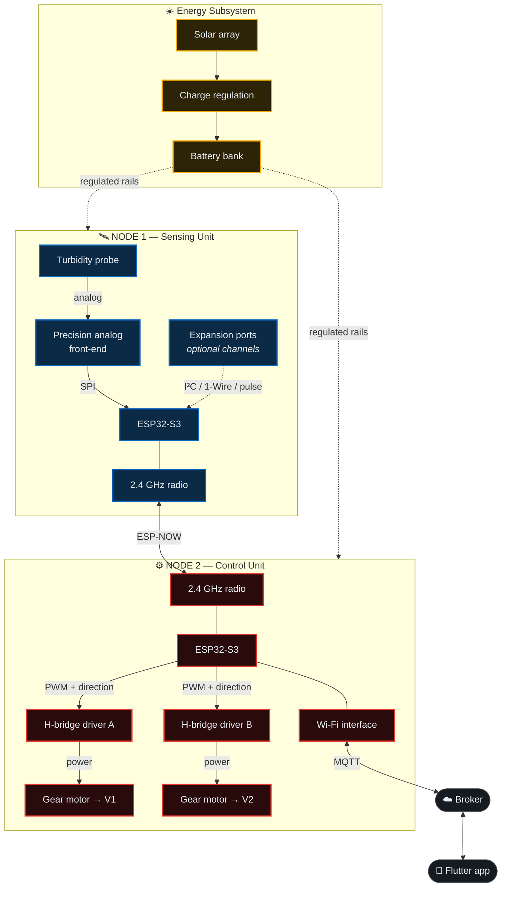
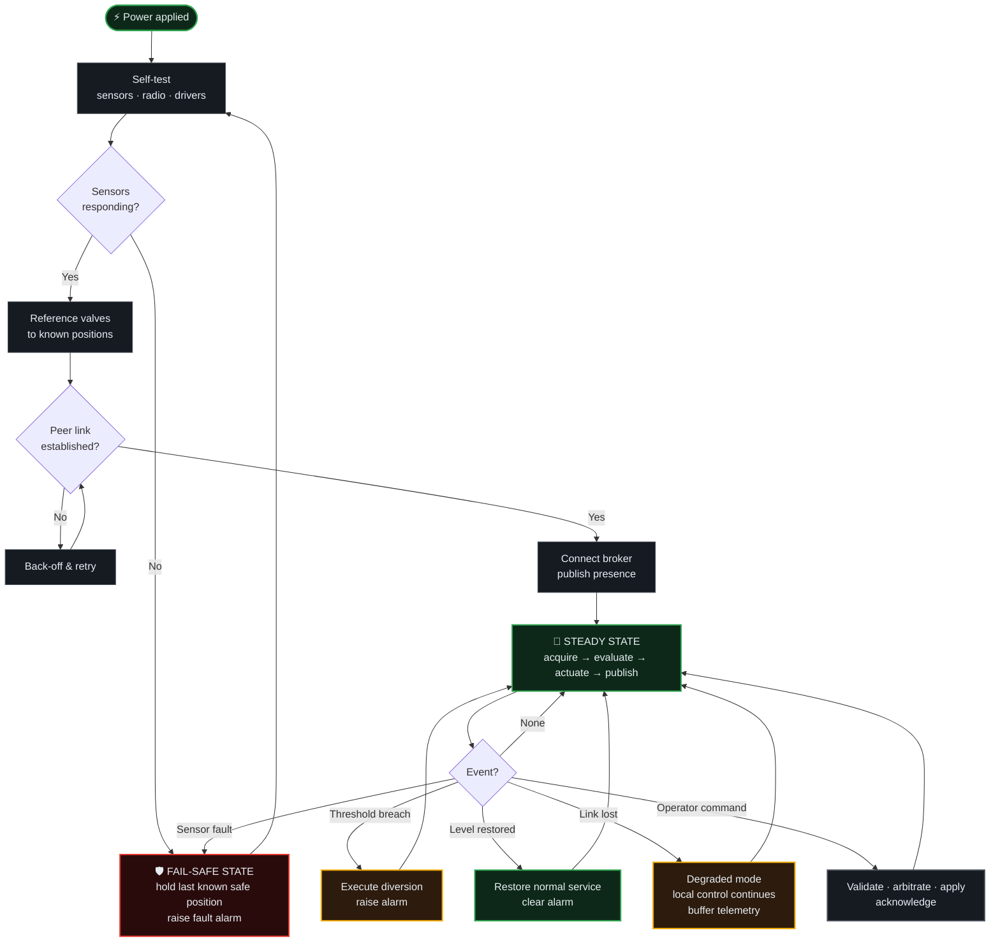

<div align="center">

# System Architecture

**CONCAP** · Control de Captación

<sub><a href="../README.md">← Back to README</a> · <a href="SystemOverview.md">System Overview</a> · <a href="Installation.md">Installation</a> · <a href="UserGuide.md">User Guide</a> · <a href="ProjectHighlights.md">Project Highlights</a></sub>

</div>

---

> [!IMPORTANT]
> This document describes the system at **architectural level of abstraction**. Implementation details — firmware, schematics, algorithms, calibration models, and credentials — are proprietary and deliberately withheld. See [LICENSE](../LICENSE).

<br/>

## 1. Design drivers

Every structural decision in CONCAP traces back to one of five constraints imposed by the deployment site.

| # | Constraint | Architectural consequence |
|:---:|:---|:---|
| 1 | **No grid power at the intake** | Autonomous solar supply; every subsystem sized against a strict energy budget. |
| 2 | **No network infrastructure at the intake** | ESP-NOW peer link instead of Wi-Fi at the sensing point; only one node needs connectivity. |
| 3 | **High-current actuation next to microvolt sensing** | Physical and electrical separation into two nodes — the single most consequential decision in the design. |
| 4 | **Unattended operation in a harsh outdoor environment** | IP66 sealing, transient protection, and explicit fail-safe states for every fault mode. |
| 5 | **Operators are not engineers** | Configuration exposed through a mobile application; no reflashing required to change operating parameters. |

<br/>

---

## 2. Layered view

The system decomposes into five layers. Each layer depends only on the one beneath it, which is what allows the sensing set to be extended without touching control or telemetry.

```mermaid
flowchart TB
    subgraph L5["🖥 PRESENTATION LAYER"]
        A1["Flutter Mobile Application"]
        A2["Dashboard · Alarms · Configuration"]
    end

    subgraph L4["☁️ INTEGRATION LAYER"]
        B1["MQTT Broker"]
        B2["Topic namespace · Retained state · QoS"]
    end

    subgraph L3["⚙️ CONTROL LAYER"]
        C1["Decision engine — threshold & hysteresis"]
        C2["Valve state machine"]
        C3["Fail-safe arbitration"]
    end

    subgraph L2["📡 TRANSPORT LAYER"]
        D1["ESP-NOW peer management"]
        D2["Retry · link-loss detection"]
    end

    subgraph L1["🔬 ACQUISITION LAYER"]
        E1["Sensor sampling — channel agnostic"]
        E2["Filtering · conditioning · framing"]
    end

    L1 --> L2 --> L3 --> L4 --> L5
    L5 -. "commands & configuration" .-> L4
    L4 -. .-> L3

    classDef lay fill:#0d1117,stroke:#30363d,stroke-width:2px,color:#e6edf3
    class A1,A2,B1,B2,C1,C2,C3,D1,D2,E1,E2 lay
```

**Why this ordering matters.** The control layer sits *below* the integration layer, not above it. The decision to divert is taken locally on Node 2 and does not depend on the broker, the internet, or the application being reachable. Cloud connectivity is a supervision channel, not a control path — if it fails, the aqueduct is still protected.

<br/>

---

## 3. Data flow

From raw physical signal to operator screen, and back down as configuration.

```mermaid
flowchart LR
    P(["💧 Raw water<br/>at intake"]) --> S1["Optical<br/>transduction"]
    S1 --> S2["Analog<br/>conditioning"]
    S2 --> S3["24-bit<br/>conversion"]
    S3 --> S4["Digital<br/>filtering"]
    S4 --> S5["Engineering<br/>units"]
    S5 --> S6["Payload<br/>framing"]

    S6 --> T{{"📡 ESP-NOW<br/>field link"}}

    T --> D1["Threshold<br/>evaluation"]
    D1 --> D2{"Above<br/>threshold?"}
    D2 -->|Yes| ACT["⚠️ Diversion<br/>sequence"]
    D2 -->|No| NRM["✅ Normal<br/>service"]

    ACT --> PUB["Telemetry +<br/>alarm publish"]
    NRM --> PUB

    PUB --> BR{{"☁️ MQTT<br/>broker"}}
    BR --> UI["📱 Operator<br/>dashboard"]

    UI -.->|"new threshold"| BR
    BR -.->|"command"| D1

    classDef src fill:#0b2a45,stroke:#0A66C2,stroke-width:2px,color:#e6edf3
    classDef proc fill:#161b22,stroke:#484f58,color:#e6edf3
    classDef dec fill:#2d1b0d,stroke:#F2A900,stroke-width:2px,color:#e6edf3
    classDef out fill:#0d2818,stroke:#2ea44f,stroke-width:2px,color:#e6edf3

    class P src
    class S1,S2,S3,S4,S5,S6,D1,PUB proc
    class D2,ACT dec
    class NRM,UI out
```



Two properties of this pipeline are worth noting:

- **Conditioning happens before transmission.** Node 1 sends engineering units, not raw counts. Node 2 never needs to know how a sensor is characterized, which is what makes the sensing set extensible.
- **The command path re-enters at the decision stage**, not at the actuation stage. Operator input adjusts *policy*, it does not bypass it — even a manual override is arbitrated by the fail-safe logic.

<br/>

---

## 4. Component interaction

How the physical components relate, and where the boundaries lie.



> [!NOTE]
> The **only coupling between the two nodes is the radio link**. There is no shared ground, no shared power rail, and no signal wire crossing between them. This is what keeps motor switching transients out of the microvolt-level turbidity measurement.

<br/>

---

## 5. System workflow

The operational lifecycle, from cold start to steady state.



**Degraded mode is the interesting branch.** When the broker becomes unreachable, the system does not stop protecting the aqueduct — it keeps acquiring, deciding, and actuating locally, and buffers telemetry for backfill once connectivity returns. Loss of supervision is not loss of control.

<br/>

---

## 6. Architectural trade-offs

Decisions worth defending, with the alternatives that were rejected.

| Decision | Alternative considered | Why the chosen path won |
|:---|:---|:---|
| **Two physically separate nodes** | Single node with careful PCB partitioning | Motor inrush transients are difficult to suppress to microvolt levels on a shared board. Physical separation solves the problem structurally rather than by mitigation. |
| **ESP-NOW between nodes** | Wi-Fi AP at the intake · LoRa · wired RS-485 | No infrastructure required, far lower power than an AP, lower latency than LoRa, and no cable to trench or protect between the two enclosures. |
| **Local control decision** | Cloud-side decision logic | Water safety cannot depend on internet availability. Cloud involvement in the control path would introduce a failure mode with physical consequences. |
| **24-bit external ADC** | ESP32-S3 internal ADC | The internal converter lacks the resolution and noise performance to resolve the turbidity range meaningfully at the low end. |
| **Hysteresis band on the threshold** | Simple comparison against a setpoint | A bare comparator would chatter the valves around the threshold, wearing the gearboxes and flooding the operator with alarms. |
| **Configuration over MQTT** | Hardcoded parameters requiring reflash | Site conditions change seasonally. Requiring a laptop and a trip to the intake to adjust a threshold would have made the system unusable in practice. |

<br/>

---

## 7. Fail-safe philosophy

Every fault mode has a defined, pre-determined outcome. None of them leave the aqueduct exposed.

| Fault condition | System response |
|:---|:---|
| **Sensor unresponsive or out of range** | Enter fail-safe state, hold the last known safe valve configuration, raise a fault alarm. |
| **ESP-NOW link lost** | Node 2 holds current state and alarms; it does not assume water is clean in the absence of data. |
| **Broker unreachable** | Local control continues unaffected; telemetry is buffered for backfill. |
| **Battery below threshold** | Graceful degradation with reduced duty cycle; safe valve position reached before shutdown. |
| **Motor stall or travel timeout** | Drive is cut, fault is latched and alarmed, no repeated stall attempts. |
| **Power loss mid-transition** | Valves are referenced to known positions on the next startup before normal operation resumes. |

The governing principle: **absence of evidence that water is safe is treated as evidence that it is not.**

<br/>

---

<div align="center">

<sub><a href="../README.md">← Back to README</a></sub>

<sub><b>CONCAP</b> — <i>Control de Captación</i> · Proprietary. All rights reserved.</sub>

</div>
