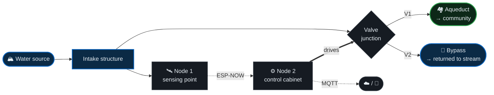

# System Overview

**CONCAP** · Control de Captación

<a href="../README.md">← Back to README</a> · <a href="Architecture.md">Architecture</a> · <a href="Installation.md">Installation</a> · <a href="UserGuide.md">User Guide</a> · <a href="ProjectHighlights.md">Project Highlights</a>

---

## 1. The problem

A rural community aqueduct draws water from a surface source — a stream or river feeding a gravity intake. Under normal conditions the water is clear enough to enter the distribution network directly.

After heavy rainfall, that changes within minutes. Runoff carries sediment into the source and turbidity rises sharply. Without intervention:

1. Sediment-laden water enters the intake and travels down the aqueduct.
2. Storage tanks are contaminated, not just the water in transit.
3. Service must be suspended while tanks are drained, flushed, and disinfected.
4. The community loses water for **days**, not hours.

The conventional mitigation is an operator who walks to the intake during or after a storm and closes a valve by hand. This fails for predictable reasons: the intake is remote, storms happen at night, and by the time anyone arrives the sediment has already passed through.

> The window between "turbidity rises" and "contamination is irreversible" is measured in minutes. Human response time is measured in hours.

 

---

## 2. The response

CONCAP places the decision at the intake itself and removes the human from the critical path.

<table>
<tr>
<td width="25%" valign="top"><b>Measure</b> Turbidity is sampled continuously at the intake through a precision analog chain.</td>
<td width="25%" valign="top"><b>Decide</b> Each reading is evaluated locally against an operator-set threshold with hysteresis.</td>
<td width="25%" valign="top"><b>Act</b> On breach, flow is diverted away from the aqueduct within seconds — automatically.</td>
<td width="25%" valign="top"><b>Inform</b> The operator receives a push alarm and can supervise the site remotely.</td>
</tr>
</table>

The operator is not removed from the system — they are **moved from executor to supervisor**. The machine handles the seconds-scale response; the human handles judgment, exceptions, and maintenance.

 

---

## 3. Physical topology

The two valves are **mutually exclusive by design**. V1 and V2 are never both open — the hydraulic path is either toward the community or toward the bypass, never split. This is enforced in the control layer, not left to sequencing chance.

 

---

## 4. The two nodes

### Node 1 — Sensing Unit

Positioned at the water contact point. Its only job is to produce trustworthy measurements.

| Aspect | Description |
|:---|:---|
| **Function** | Acquire, condition, and transmit water-quality measurements. |
| **Core** | ESP32-S3 |
| **Primary channel** | Optical turbidity via 24-bit delta-sigma front-end with programmable gain |
| **Expansion** | Channel-agnostic acquisition layer — see [Sensor Expansion](../README.md#sensor-expansion) |
| **Output** | Framed payload in engineering units over ESP-NOW |
| **What it does not do** | It holds no control authority. It cannot move a valve. |

Keeping Node 1 free of control responsibility is deliberate: a sensing fault degrades data quality, it never causes unintended actuation.

 

### Node 2 — Control Unit

Positioned at the valve junction, in the control cabinet. It holds all decision authority.

| Aspect | Description |
|:---|:---|
| **Function** | Evaluate measurements, actuate valves, publish telemetry, accept commands. |
| **Core** | ESP32-S3 |
| **Actuation** | Two H-bridge stages driving DC gear motors coupled to V1 and V2 |
| **Field link** | ESP-NOW peer with Node 1 |
| **Uplink** | Wi-Fi → MQTT broker |
| **Autonomy** | Full control capability without broker or internet connectivity |

 

---

## 5. Operating states

The system has exactly two normal hydraulic states and one protective state.

| State | V1 (aqueduct) | V2 (bypass) | Meaning |
|:---|:---:|:---:|:---|
| 🟢 **Normal service** | Open | Closed | Water quality within limits; community is being supplied. |
| 🔴 **Diversion active** | Closed | Open | Turbidity exceeded threshold; source is isolated and purged. |
| 🛡 **Fail-safe** | Held | Held | A fault was detected; last known safe configuration is held and alarmed. |

Transitions between the two normal states are governed by a **hysteresis band** rather than a single setpoint. Without it, a turbidity signal oscillating around the threshold would cycle the valves repeatedly — mechanically destructive and operationally useless.

 

---

## 6. Energy

The intake has no grid connection. The entire system runs on a solar array with a battery bank sized for continuous unattended operation, including consecutive overcast days.

This constraint shaped the architecture as much as any functional requirement:

- ESP-NOW was chosen partly because maintaining a Wi-Fi access point at the sensing point would have dominated the power budget.
- Acquisition and publishing follow a duty cycle rather than running flat out.
- Motor actuation — by far the largest instantaneous load — is brief, infrequent, and current-limited.
- The system degrades gracefully on low battery, reaching a safe valve position before shutdown rather than stopping wherever it happens to be.

 

---

## 7. Technology stack

| Domain | Technology |
|:---|:---|
| **Embedded compute** | ESP32-S3 (×2) |
| **Analog acquisition** | ADS1220 — 24-bit ΔΣ ADC with PGA |
| **Water quality sensing** | JXSZ-1001 optical turbidity probe |
| **Field communications** | ESP-NOW (2.4 GHz, connectionless) |
| **Telemetry transport** | MQTT over Wi-Fi |
| **Motor drive** | BTS7960 H-bridge (×2) |
| **Actuators** | Dual DC gear motors |
| **Mobile application** | Flutter (cross-platform) |
| **Power** | Solar array · charge regulation · battery bank |
| **Enclosure** | IP66 rated outdoor housing |

 

---

## 8. What this system is — and is not

**It is** an automated intake protection system. It decides whether source water is fit to enter the network, and acts on that decision without waiting for a human.

**It is not** a water treatment system. CONCAP does not filter, clarify, or disinfect. It prevents contaminated water from entering the network; it does not make contaminated water safe.

**It is not** a regulatory potability instrument. Turbidity is used as a fast, reliable proxy for a specific contamination event — sediment from runoff. Formal potability assessment requires laboratory analysis of parameters outside this system's scope, though several are available as [expansion channels](../README.md#sensor-expansion).

Being precise about this boundary is part of the engineering. Overstating what an automated system guarantees, in a context involving drinking water, would be irresponsible.

 

---

<a href="../README.md">← Back to README</a>

<b>CONCAP</b> — <i>Control de Captación</i> · Proprietary. All rights reserved.

