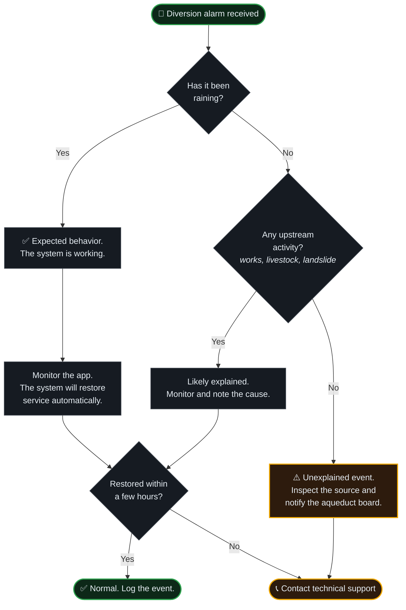

# Operator User Guide

**CONCAP** · Control de Captación

<a href="../README.md">← Back to README</a> · <a href="Architecture.md">Architecture</a> · <a href="SystemOverview.md">System Overview</a> · <a href="Installation.md">Installation</a> · <a href="ProjectHighlights.md">Project Highlights</a>

---

> [!NOTE]
> This guide is written for the **aqueduct operator** — the person responsible for the water supply, not an engineer. It describes what the system does, what the application shows, and what to do when it raises an alarm.
>
> It is reproduced here as a documentation sample. The delivered guide is site-specific and includes the actual thresholds, contacts, and procedures for the installation.

 

---

## 1. What the system does for you

CONCAP watches the water at the intake continuously and closes the aqueduct automatically if the water becomes too dirty.

**You do not need to do anything for this to work.** The system operates on its own, day and night, including when you are asleep and when there is no internet. The application exists so you can *see* what is happening and *change* how the system behaves — not because the system needs you to run it.

Three things are worth internalizing:

1. **A diversion alarm is not a failure.** It means the system did its job. Dirty water was detected and the community was protected.
2. **The system will not make dirty water clean.** It only prevents it from entering the network.
3. **If you lose phone signal, the system keeps protecting the aqueduct.** You lose visibility, not protection.

 

---

## 2. Understanding the two states

<table>
<tr>
<td width="50%" valign="top">

### 🟢 Normal service

The water is clean enough.

- Valve **V1 is open** — water flows to the community.
- Valve **V2 is closed** — the bypass is sealed.
- The app shows a green status.

**Your action:** none.

</td>
<td width="50%" valign="top">

### 🔴 Diversion active

The water is too dirty.

- Valve **V1 is closed** — the aqueduct is protected.
- Valve **V2 is open** — dirty water is purged.
- The app shows a red status and you receive a notification.

**Your action:** see §4.

</td>
</tr>
</table>

The system switches between these on its own. It also waits before switching back, so that a brief clearing of the water does not reopen the aqueduct prematurely.

 

---

## 3. The mobile application

| Screen | What it shows you |
|:---|:---|
| **Live Dashboard** | Current turbidity and its recent trend. The trend matters more than the instantaneous number — a rising line during rain is your early warning. |
| **Valve Status** | Whether V1 and V2 are open or closed, and when they last changed. |
| **Alarms** | A dated list of every event. Useful for reporting to the aqueduct board. |
| **Configuration** | The turbidity threshold and operating parameters. Change with care — see §5. |
| **Manual Override** | Direct valve commands, with a confirmation step. For maintenance and exceptional situations. |
| **System Health** | Node connectivity, radio link quality, and battery charge. Check this monthly. |

 

---

## 4. What to do when you get an alarm

**The key question is always: is there a reason for the water to be dirty right now?** If yes, the system is behaving correctly and will restore service on its own. If no, something at the source deserves a look.

 

---

## 5. Changing the threshold

The threshold determines how dirty the water must be before the aqueduct closes. It was set during commissioning based on your source's actual behavior.

> [!WARNING]
> **Raising the threshold makes the system less protective.** It will tolerate dirtier water before closing. Never raise it simply to stop receiving alarms — frequent alarms mean your source is frequently dirty, which is information, not a nuisance.

| If you observe | Consider |
|:---|:---|
| Alarms during rain, service restored within hours | Nothing. This is correct behavior. |
| Alarms with no visible change in water quality | Lowering is *not* the answer — the probe may need cleaning. Contact support. |
| Visibly dirty water reaching the tanks without an alarm | The threshold may be too high, or the probe is fouled. Contact support before adjusting. |
| Constant cycling between states | Contact support. The hysteresis band likely needs tuning. |

**When in doubt, do not change it.** Record what you observed and contact technical support. An incorrectly set threshold is worse than no automation, because it creates false confidence.

 

---

## 6. Manual override

Manual override lets you command the valves directly. It exists for two legitimate situations:

- **Maintenance** — closing the intake to work on the network downstream.
- **Known contamination the sensor cannot see** — for example a chemical spill upstream, which turbidity does not detect.

> [!CAUTION]
> While manual override is active, **automatic protection is suspended**. If you leave the aqueduct open manually and a turbidity event occurs, the system will not close it for you. Always return the system to automatic mode when you finish.

 

---

## 7. Routine checks

| When | What to check |
|:---|:---|
| **After heavy rain** | Open the app and confirm the system responded and restored service. |
| **Monthly** | Review System Health — battery charge, link quality, both nodes reporting. |
| **Quarterly** | Coordinate the scheduled maintenance visit (probe cleaning is essential). |
| **Anytime the app shows a node offline for more than a day** | Contact technical support. |

 

---

## 8. When to call for support

Contact technical support if you see any of the following:

- A node has been offline for more than 24 hours.
- Battery charge is declining over several days of normal weather.
- The system cycles rapidly between states.
- A fault alarm that does not clear.
- Water quality does not match what the app reports.
- Valves do not respond to a manual command.

Contact details are in the [README](../README.md#-contact).

 

---

<a href="../README.md">← Back to README</a>

<b>CONCAP</b> — <i>Control de Captación</i> · Proprietary. All rights reserved.

